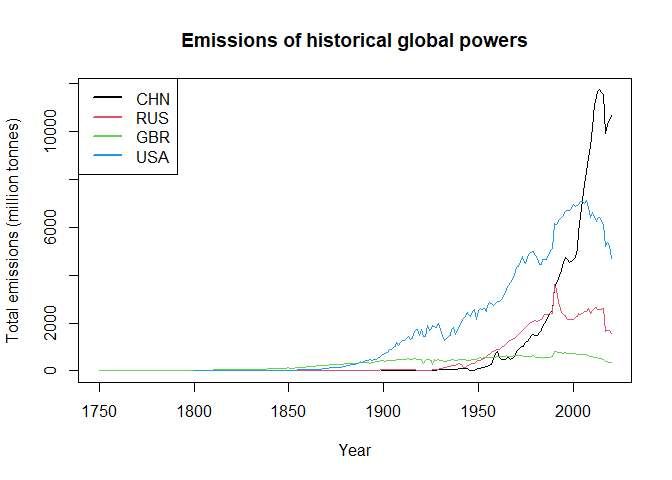
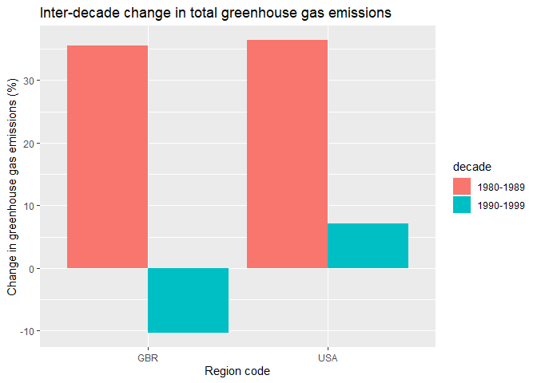
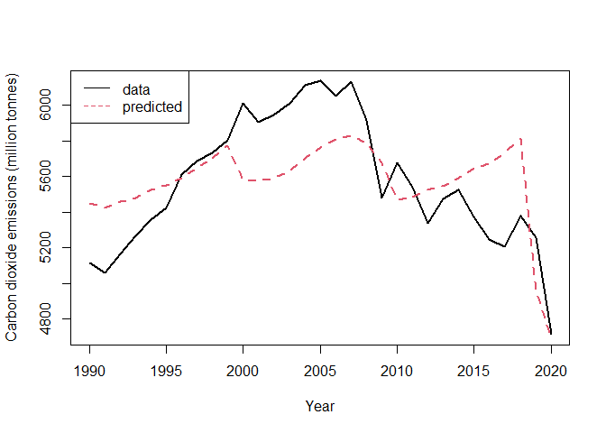
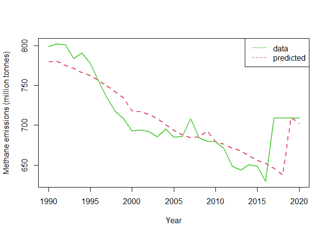
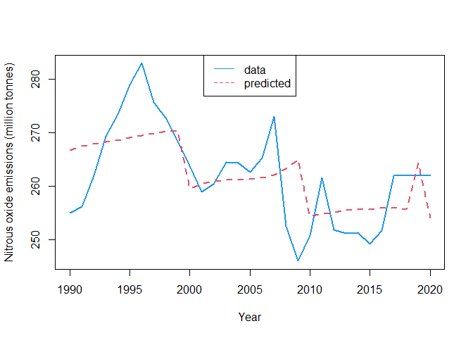
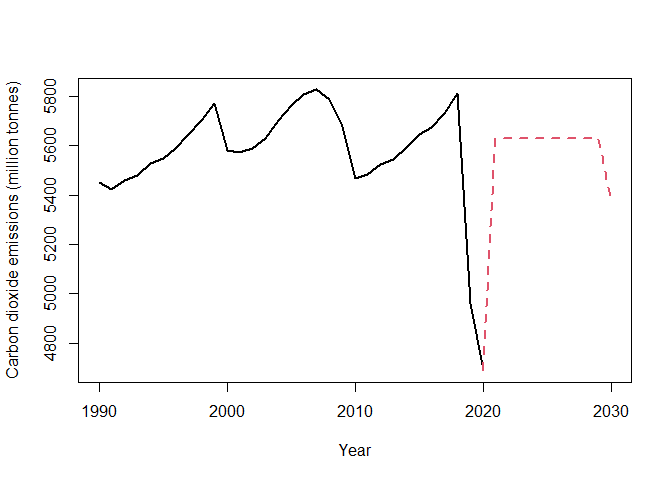
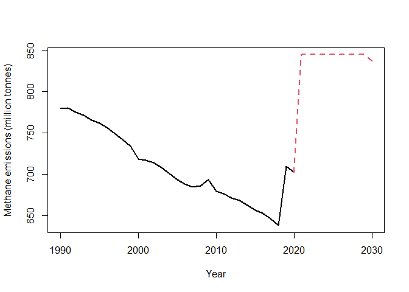
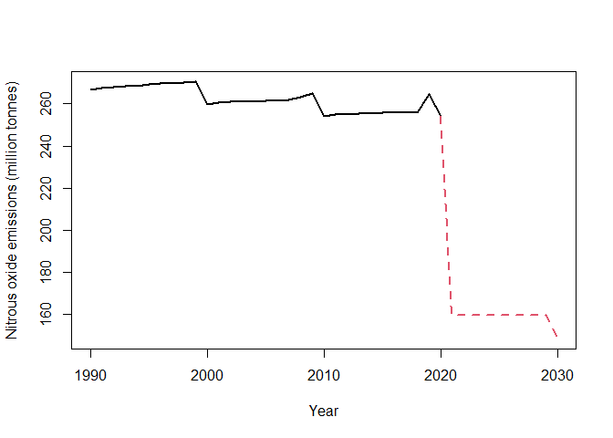

<!-- README.md is generated from README.Rmd. Please edit that file -->

# ccplot

<!-- badges: start -->
<!-- badges: end -->

The goal of ccplot is to provide out-of-the-box data visualization tools
to analyze and understand worldwide greenhouse gas emissions.

## Installation

You can install the development version of ccplot from
[GitHub](https://github.com/) with:

``` r
# install.packages("devtools")
devtools::install_github("omunizb/climate-change")
```

## Usage

Currently, `ccplot` has four plotting functions. The following examples
use a [Data on CO2 and Greenhouse Gas Emissions by *Our World in
Data*](https://github.com/owid/co2-data) dataset by Hannah Ritchie, Max
Roser, Edouard Mathieu and Bobbie Macdonald:

``` r
Greenhouse_Gas_Emissions <- 
  read.csv("https://raw.githubusercontent.com/owid/co2-data/master/owid-co2-data.csv")
```

-   `ccplot::plot_emissions()` draws a plot of annual greenhouse gas
    emissions for the desired countries or regions.

``` r
library(ccplot)

plot_emissions(Greenhouse_Gas_Emissions, c("USA", "CHN", "GBR", "RUS"), 
               "Emissions of historical global powers")
```



-   `ccplot::decade_increase()` draws a plot of decade-to-decade change
    in total greenhouse gas emissions (carbon dioxide, methane and
    nitrous oxide) for the the desired countries or regions and decades.

``` r
library(ccplot)

decade_increase(Greenhouse_Gas_Emissions, c("1990-1999", "1980-1989"), 
                c("USA", "GBR"))
#> # A tibble: 2 x 2
#>   iso_code average
#>   <chr>      <dbl>
#> 1 GBR         661.
#> 2 USA        5597.
```



-   `ccplot::lproj()` draws plots with actual and predicted annual
    emissions since 1990.

``` r
library(ccplot)

lproj(df = Greenhouse_Gas_Emissions, region = "USA")
#> Warning in mean.default(proj[, i][[1]], na.rm = TRUE): argument is not numeric
#> or logical: returning NA

#> Warning in mean.default(proj[, i][[1]], na.rm = TRUE): argument is not numeric
#> or logical: returning NA
```



-   `ccplot::emissions_pred()` draws plots with actual past and
    projected future annual greenhouse gas emissions from 1990.

``` r
library(ccplot)

data(futdata)

emissions_pred(Greenhouse_Gas_Emissions, "USA", futdata)
#> Warning in mean.default(proj[, i][[1]], na.rm = TRUE): argument is not numeric
#> or logical: returning NA

#> Warning in mean.default(proj[, i][[1]], na.rm = TRUE): argument is not numeric
#> or logical: returning NA
```



As you can see in this example, `ccplot` also includes the dataset
`futdata`with projections of US population and GDP until 2030.
